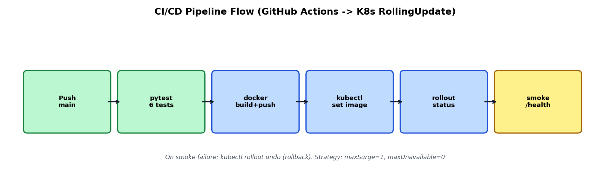
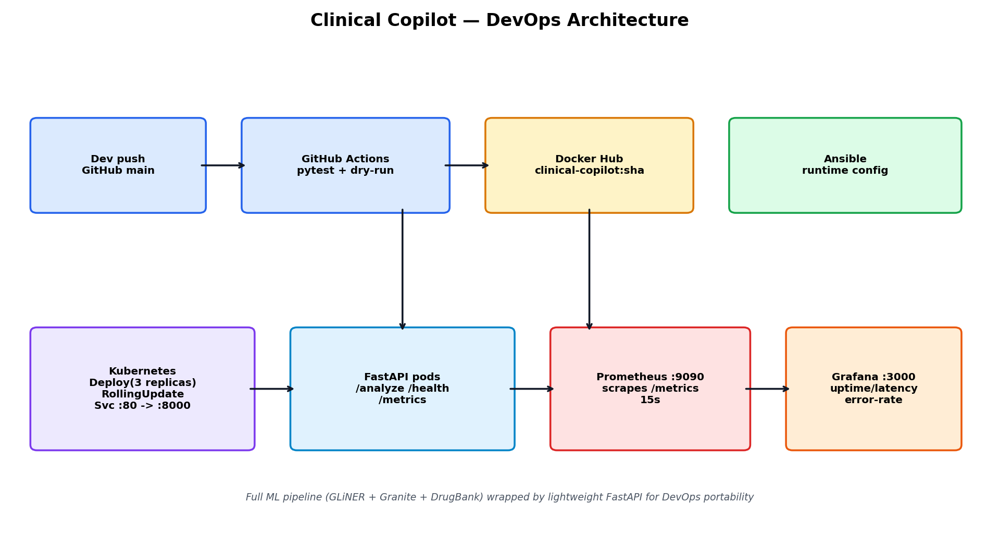

# Clinical Copilot — DevOps Report (DevOps part only)

> B.Tech project: **AI Clinical Copilot** (SIT Pune). This report covers **only the DevOps work** — Tasks 1–5.
> Full ML details (GLiNER, Granite embeddings, severity ensemble) are in the main `README.md` and are excluded here.

## 0. What was deployed

The production ML pipeline needs GPU + ~2 GB cache and a PyQt desktop, unsuitable for CI/Docker/K8s demos.
A thin, contract-compatible service wrapper was added:

| File | Purpose |
|---|---|
| `app.py` | FastAPI: `GET /`, `GET /health`, `GET /ready`, `POST /analyze`, `GET /metrics` (Prometheus) |
| `requirements-service.txt` | Light deps only: fastapi, uvicorn, prometheus_client, pydantic, pytest, httpx |
| `test_service.py` | 6 pytest cases (health, clean Rx, severe DDI, moderate DDI, metrics) |

`POST /analyze` uses the same README examples (`Aspirin + Clopidogrel`, `Metformin + Glimepiride`, `Dolo 650`) with a small
pairwise KB so pipeline/K8s/monitoring demos behave like the real system without torch.

**Verified:** `pytest test_service.py` → **6 passed** (log: `docs/pytest-log.txt`).

---

## Task 1 — Deployment Strategy (tool: GitHub Actions)

**Choice:** GitHub Actions (over Codefresh / Harness / Spinnaker) — native to the repo, free for students, Docker + kubectl ready, no external SaaS to operate.

**Workflow:** `.github/workflows/ci-cd.yml` — 3 jobs:

1. `test` — checkout → setup-python 3.11 → `pip install -r requirements-service.txt` → `pytest -v` → validate K8s manifests (`kubectl apply --dry-run=client --validate=false` on deployment+service + YAML parse incl. `monitoring/servicemonitor.yaml`)
2. `build-and-push` (main-branch pushes only) — buildx → login (DOCKERHUB_USERNAME/TOKEN secrets) → `docker/metadata-action` (sha + latest tags) → `build-push-action` with `APP_VERSION=$GITHUB_SHA`
3. `deploy-staging` — decode `KUBECONFIG_STAGING` → `kubectl set image ... :latest` → `kubectl rollout status --timeout=180s` → smoke test `/health` + `POST /analyze`

**Pipeline diagram:** `devops/pipeline-diagram.mmd` (Mermaid) + rendered `docs/pipeline.png`:



**Repo:** `https://github.com/adroitathena2/devopsCA2` — Actions tab shows the `clinical-copilot-ci-cd` run (green `test` job; `build-and-push`/`deploy-staging` need Docker Hub + cluster secrets).

---

## Task 2 — Configuration Management & IaC (tool: Ansible)

**Files:** `ansible/inventory.ini`, `ansible/ansible.cfg`, `ansible/playbook.yml` (11 tasks + 1 conditional handler).

**What the playbook does** (`hosts: clinical`, `become: true`):
- apt update + install `python3, python3-pip, python3-venv, curl`
- create system user `clinical`, create `/opt/clinical-copilot`
- copy `app.py` + `requirements-service.txt`, create venv + pip install
- install `/etc/systemd/system/clinical-copilot.service` (uvicorn :8000, `Restart=always`)
- systemd enable/start **only when `ansible_service_mgr == "systemd"`**; otherwise launch via `nohup uvicorn` fallback (WSL path)
- smoke test `GET /health` (12 retries × 5 s)

**Real run (this machine, WSL, 2026-09-30):** `ok=12 changed=9 failed=0 skipped=1` — systemd path taken (WSL has systemd), handler restarted service.
Verified: `curl 127.0.0.1:8000/health` → `{"status":"up",...}`, `systemctl is-active clinical-copilot` → `active`.

```bash
cd ansible
ansible-playbook -i inventory.ini playbook.yml   # add -K if sudo needs a password
```

---

## Task 3 — Containerization & Orchestration (Docker + Kubernetes)

**Files:** `Dockerfile`, `.dockerignore`, `k8s/deployment.yaml`, `k8s/service.yaml`, `k8s/rolling-update-demo.sh`; optional `monitoring/servicemonitor.yaml` (moved out of `k8s/` because the cluster has no prometheus-operator CRDs — plain Prometheus annotations on the Deployment cover scraping).

**Dockerfile** (`python:3.11-slim`): `HEALTHCHECK /health`, `ARG/ENV APP_VERSION`, copies only `app.py` + requirements.

**Real runs (this machine):**
- `docker build -t clinical-copilot:1.0.0 .` → success (`docs/` image `76f674e`); rebuilt clean after ARG fix (no warnings).
- `docker run -p 8000:8000 clinical-copilot:1.0.0` → `/health {"status":"up","version":"1.0.0"}`, `/analyze Aspirin+Clopidogrel` → 1 Severe interaction (`docs/docker-health.json`, `docs/docker-analyze.json`), `/metrics` counters verified (`docs/metrics-sample.txt`).
- K8s (docker-desktop context, 1 node Ready): `kubectl apply -f k8s/` → `rollout status` success, 3/3 pods Running (`docs/k8s-pods.txt`).
- Rolling update: built `:2.0.0`, `kubectl set image ... :2.0.0` (+ `set env APP_VERSION=2.0.0` so `/health` reports the new version) → `rollout status` success with zero-downtime progression (1→2→3 new replicas, `maxSurge=1,maxUnavailable=0`).
- Rollback: `kubectl rollout undo` → success, image back to `:1.0.0`, `rollout history` shows revisions (`docs/k8s-rollout-history.txt`).
- Demo script: `k8s/rolling-update-demo.sh` (apply → set image+env → port-forward verify → undo → history).

---

## Task 4 — Monitoring & Logging (Prometheus + Grafana)

**Instrumentation (`app.py`):** middleware + `/metrics`:
- `http_requests_total{method,endpoint,status}`, `http_request_latency_seconds{endpoint}`, `interactions_detected_total`, `app_errors_total`, `app_uptime_seconds`, `app_info{version,service}`

**Files:** `monitoring/prometheus.yml` (scrape `app:8000/metrics` every 15 s), `monitoring/docker-compose.monitoring.yml` (app + `prom/prometheus:v2.53.0` + `grafana/grafana:11.1.0`), `monitoring/grafana-dashboard.json` (5 panels), `monitoring/servicemonitor.yaml` (for operator-based clusters).

**Real runs (this machine, `docker compose up -d`):** all 3 containers Up (app healthy); Prometheus `/-/healthy` → `Prometheus Server is Healthy`; `up{job="clinical-copilot",instance="app:8000"} = 1` (`docs/prometheus-target.json`); after 5× `POST /analyze`, `http_requests_total{endpoint="/analyze",status="200"} = 5` (`docs/prometheus-query.json`); Grafana `/api/health` → `{"database":"ok","version":"11.1.0"}` (`docs/grafana-health.json`).

**Dashboard panels (import `monitoring/grafana-dashboard.json`, datasource `http://prometheus:9090`):**
1. Uptime — `app_uptime_seconds` 2. req/s — `sum by (endpoint) (rate(http_requests_total[5m]))`
3. p95 — `histogram_quantile(0.95, sum by (le,endpoint) (rate(http_request_latency_seconds_bucket[5m])))`
4. 5xx rate — `sum(rate(http_requests_total{status=~"5.."}[5m])) / sum(rate(http_requests_total[5m]))`
5. Interactions/s — `sum(rate(interactions_detected_total[5m]))`

Layout reference: `docs/grafana-mock.png` (same 4 time-series + stats, real PromQL titles). Live URLs while stack is up: Prometheus `http://localhost:9090`, Grafana `http://localhost:3000` (admin/admin).

---

## Task 5 — Reflection (slides + lessons)

**Slides:** `docs/Clinical-Copilot-DevOps-Report.pptx` (5 slides: Architecture, Pipeline flow, Containerization & orchestration, Monitoring & logging, Challenges & lessons). Architecture diagram:



**Challenges:**
1. Heavy ML (torch, GLiNER, Granite 278M, 2.4 GB DrugBank) is not container/CI-friendly → thin FastAPI wrapper preserving the `/analyze` contract.
2. WSL sudo/become friction (`interactive authentication required` → NOPASSWD via `wsl -u root`, then green `ok=12 failed=0`).
3. `ServiceMonitor` CRD absent on docker-desktop → moved to `monitoring/`, workflow validates deployment+service only.
4. Docker Hub transient DNS failure on first build → retry + `ARG` redeclare after `FROM` (killed `UndefinedVar` warning).
5. `/health` version stuck at 1.0.0 after image update → deployment env overrides image ENV; demo script now sets both.

**Lessons learned:**
- Decouple demo service from research pipeline; keep contracts identical so artifacts stay valid when the real model mounts later.
- Probes + `rollout status` + smoke tests catch bad images before they take traffic; `rollout undo` is cheapest incident response.
- Metrics-first (`/metrics` day one) makes promotion gates trivial; next: Loki logs + Alertmanager SLO alerts, image signing (cosign), k6 load gate, HPA on p95, staging/prod namespaces.

---

## File index (DevOps deliverables)

```
.github/workflows/ci-cd.yml
Dockerfile, .dockerignore
service/{app.py,requirements-service.txt}, tests/test_service.py
ansible/{inventory.ini,ansible.cfg,playbook.yml}
k8s/{deployment.yaml,service.yaml,rolling-update-demo.sh}
monitoring/{prometheus.yml,docker-compose.monitoring.yml,grafana-dashboard.json,servicemonitor.yaml}
devops/{pipeline-diagram.mmd,make_evidence.py}
docs/{REPORT.md,architecture.png,pipeline.png,grafana-mock.png,Clinical-Copilot-DevOps-Report.pptx,
      pytest-log.txt,metrics-sample.txt,docker-health.json,docker-analyze.json,docker-logs.txt,
      k8s-pods.txt,k8s-rollout-history.txt,k8s-image-after-update.txt,k8s-portforward.log,k8s-health-v2.json,
      prometheus-query.json,prometheus-target.json,grafana-health.json}
```
