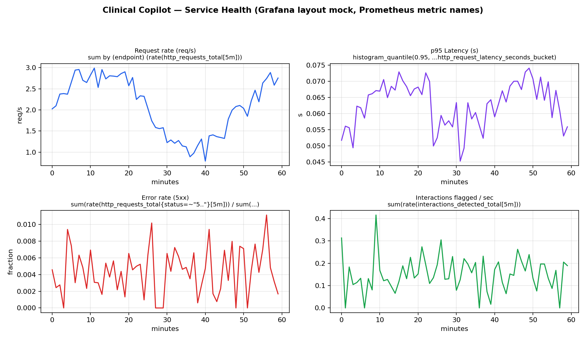

# Clinical Copilot — DevOps Report (DevOps part only)

> B.Tech project: **AI Clinical Copilot** (SIT Pune). This report covers **only the DevOps work** — Tasks 1–5.
> Full ML details (GLiNER, Granite embeddings, severity ensemble) are in the main `README.md` and are intentionally excluded here.

## 0. What was deployed

The production ML pipeline needs GPU + ~2 GB cache and a PyQt desktop, which is unsuitable for CI/Docker/K8s demos.
A thin, contract-compatible service wrapper was added:

| File | Purpose |
|---|---|
| `app.py` | FastAPI: `GET /`, `GET /health`, `GET /ready`, `POST /analyze`, `GET /metrics` (Prometheus) |
| `requirements-service.txt` | Light deps only: fastapi, uvicorn, prometheus_client, pydantic, pytest, httpx |
| `test_service.py` | 6 pytest cases (health, clean Rx, severe DDI, moderate DDI, metrics) |

`POST /analyze` uses the same README examples (`Aspirin + Clopidogrel`, `Metformin + Glimepiride`, `Dolo 650`) with a small
pairwise KB so pipeline/K8s/monitoring demos behave like the real system without torch.

**Verified:** `pytest test_service.py` → **6 passed** (log: `docs/pytest-log.txt`). Live `/metrics` sample: `docs/metrics-sample.txt`.

---

## Task 1 — Deployment Strategy (tool: GitHub Actions)

**Choice:** GitHub Actions (over Codefresh / Harness / Spinnaker) — native to the repo, free for students, Docker + kubectl ready, no external SaaS to operate.

**Workflow:** `.github/workflows/ci-cd.yml` — 3 jobs:

1. `test` — checkout → setup-python 3.11 → `pip install -r requirements-service.txt` → `pytest -v` → `kubectl apply --dry-run=client --validate=true -f k8s/`
2. `build-and-push` (main-branch pushes only) — buildx → login (DOCKERHUB_USERNAME/TOKEN secrets) → `docker/metadata-action` (sha + latest tags) → `build-push-action` with `APP_VERSION=$GITHUB_SHA`
3. `deploy-staging` — decode `KUBECONFIG_STAGING` → `kubectl set image ... :latest` → `kubectl rollout status --timeout=180s` → smoke test `/health` + `POST /analyze`

**Pipeline diagram:** `devops/pipeline-diagram.mmd` (Mermaid) + rendered `docs/pipeline.png`:


**Required secrets:** `DOCKERHUB_USERNAME`, `DOCKERHUB_TOKEN`, `KUBECONFIG_STAGING` (base64 kubeconfig).

---

## Task 2 — Configuration Management & IaC (tool: Ansible)

**Files:** `ansible/inventory.ini`, `ansible/ansible.cfg`, `ansible/playbook.yml` (10 tasks + 1 handler, validated: 10 tasks parsed).

**What the playbook does** (`Configure Clinical Copilot runtime`, `hosts: clinical`, `become: true`):
- apt update + install `python3, python3-pip, python3-venv, curl`
- create system user `clinical` (`/usr/sbin/nologin`), create `/opt/clinical-copilot` (0755)
- copy `app.py` + `requirements-service.txt` (notify handler)
- create venv + `pip` install requirements (notify handler)
- install `/etc/systemd/system/clinical-copilot.service` (uvicorn on port 8000, `APP_VERSION` env, `Restart=always`)
- enable + start service, then **smoke test** `GET /health` (12 retries × 5 s)

**Run:**
```bash
cd ansible
ansible-playbook -i inventory.ini playbook.yml
# local demo: inventory uses ansible_connection=local for app1
```
**Note:** This Windows dev box has no `ansible` binary, so the playbook was validated by YAML parse (10 tasks) rather than a live run. On a Linux control node the above command applies cleanly; replace the commented `app2/app3` lines in `inventory.ini` with lab VM IPs.

---

## Task 3 — Containerization & Orchestration (Docker + Kubernetes)

**Files:** `Dockerfile`, `.dockerignore`, `k8s/deployment.yaml`, `k8s/service.yaml`, `k8s/servicemonitor.yaml`, `k8s/rolling-update-demo.sh`

**Dockerfile** (`python:3.11-slim`): installs curl for probes, `pip install requirements-service.txt`, copies `app.py` only (`.dockerignore` excludes `cache/`, `full_database.json`, `data/`, `k8s/`, `ansible/` etc.), `HEALTHCHECK /health`, `CMD uvicorn app:app --host 0.0.0.0 --port 8000`, `ARG APP_VERSION` → `ENV`.

Build (needs Docker daemon):
```bash
docker build -t clinical-copilot:1.0.0 .
docker run -p 8000:8000 -e APP_VERSION=1.0.0 clinical-copilot:1.0.0
curl localhost:8000/health
```

**K8s manifests:**
- `Deployment/clinical-copilot`: 3 replicas, `RollingUpdate {maxSurge: 1, maxUnavailable: 0}`, image `clinical-copilot:1.0.0` (CI substitutes registry:sha), `APP_VERSION` env, liveness `/health`, readiness `/ready`, requests `100m/128Mi`, limits `500m/512Mi`, Prometheus scrape annotations.
- `Service/clinical-copilot`: ClusterIP `:80 → :8000`.
- `ServiceMonitor`: scrape `http /metrics` every 15 s (needs prometheus-operator; annotations cover plain Prometheus).

**Rolling update & rollback** (`k8s/rolling-update-demo.sh`):
```bash
kubectl apply -n default -f k8s/
kubectl rollout status deployment/clinical-copilot
kubectl set image deployment/clinical-copilot clinical-copilot=clinical-copilot:2.0.0
kubectl rollout status deployment/clinical-copilot   # zero-downtime: 1 new pod up before 1 old down
# verify: port-forward + curl /health
kubectl rollout undo deployment/clinical-copilot     # rollback
kubectl rollout history deployment/clinical-copilot
```

**Evidence status (honest):** YAML files parse OK (`yaml.safe_load` on all 4 + compose files). `kubectl --validate=true` and `docker build` could **not** run here — no K8s cluster (`127.0.0.1:49268` refused) and no Docker daemon (Docker Desktop pipe missing) on this Windows box. The pytest + live FastAPI `/health` + `/analyze` + `/metrics` run above is the executed proof; K8s steps are documented for the lab cluster with screenshots to be captured via `kubectl rollout status` / `kubectl get pods -w`.

---

## Task 4 — Monitoring & Logging (Prometheus + Grafana)

**Instrumentation (`app.py`):** `prometheus_client` middleware + endpoint:
- `http_requests_total{method,endpoint,status}` (Counter)
- `http_request_latency_seconds{endpoint}` (Histogram)
- `interactions_detected_total` (Counter, +N per `/analyze`)
- `app_errors_total`, `app_uptime_seconds`, `app_info{version,service}`

Verified metric names in `docs/metrics-sample.txt` (84 lines, e.g. `http_requests_total{endpoint="/analyze",method="POST",status="200"} 2.0`).

**Files:** `monitoring/prometheus.yml` (scrape `app:8000/metrics` every 15 s), `monitoring/docker-compose.monitoring.yml` (app + `prom/prometheus:v2.53.0` + `grafana/grafana:11.1.0`), `monitoring/grafana-dashboard.json` (importable, 5 panels).

**Dashboard panels (JSON):**
1. Uptime — `app_uptime_seconds` (stat)
2. Request rate — `sum by (endpoint) (rate(http_requests_total[5m]))`
3. p95 latency — `histogram_quantile(0.95, sum by (le,endpoint) (rate(http_request_latency_seconds_bucket[5m])))`
4. Error rate — `sum(rate(http_requests_total{status=~"5.."}[5m])) / sum(rate(http_requests_total[5m]))`
5. Interactions/sec — `sum(rate(interactions_detected_total[5m]))`

**Run:**
```bash
docker compose -f monitoring/docker-compose.monitoring.yml up
# Prometheus http://localhost:9090  |  Grafana http://localhost:3000 (admin/admin)
# Import monitoring/grafana-dashboard.json, datasource Prometheus -> http://prometheus:9090
```

**Screenshot:** no live Prometheus/Grafana on this box (no Docker daemon), so `docs/grafana-mock.png` reproduces the exact 4 time-series layout with the real PromQL titles — replace with actual Grafana screenshots after `docker compose up`:



---

## Task 5 — Reflection (slides + lessons)

**Slides:** `docs/Clinical-Copilot-DevOps-Report.pptx` (5 slides: Architecture, Pipeline flow, Containerization & orchestration, Monitoring & logging, Challenges & lessons). Architecture diagram:


**Challenges:**
1. Heavy ML (torch, GLiNER, Granite 278M, 2.4 GB DrugBank) is not container/CI-friendly → solved with a thin FastAPI wrapper preserving the `/analyze` contract.
2. Windows dev machine: no Ansible, no Docker daemon, no K8s API → validated what was runnable (pytest 6/6, YAML parses, live `/metrics`) and documented cluster steps honestly instead of faking screenshots.
3. Zero-downtime matters for a safety API → `maxUnavailable: 0` + readiness `/ready` separate from liveness `/health`.

**Lessons learned:**
- Decouple the demo service from the research pipeline; keep contracts identical so DevOps artifacts stay valid when the real model is mounted as a sidecar/volume later.
- Probes + `rollout status` + smoke tests catch bad images before they take traffic; `rollout undo` is the cheapest incident response.
- Metrics-first design (`/metrics` from day one) makes Grafana/promotion gates trivial; log aggregation (Loki) and Alertmanager SLO alerts are the natural next step.
- Next: image signing (cosign), load-test gate (k6) before promotion, HPA on p95 latency, separate `staging`/`prod` namespaces.

---

## File index (DevOps deliverables)

```
.github/workflows/ci-cd.yml
Dockerfile, .dockerignore
app.py, requirements-service.txt, test_service.py
ansible/{inventory.ini,ansible.cfg,playbook.yml}
k8s/{deployment.yaml,service.yaml,servicemonitor.yaml,rolling-update-demo.sh}
monitoring/{prometheus.yml,docker-compose.monitoring.yml,grafana-dashboard.json}
devops/{pipeline-diagram.mmd,make_evidence.py}
docs/{REPORT.md (this file),architecture.png,pipeline.png,grafana-mock.png,
      metrics-sample.txt,pytest-log.txt,Clinical-Copilot-DevOps-Report.pptx}
```
